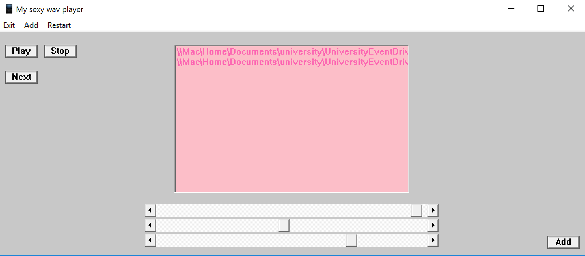

# Laboratory #2
In this laboratory work we had to create a basic c++ windows application with a listbox, dialogbox and some scrollbars.

This project was successfully compiled on Windows10 - CodeBlocks.

I created a simple Mp3Player (which plays only .wav files :)

## Objectives:
* a dialogbox pops out when an element in the listbox is double clicked;
  * this dialogbox asks the user if he wants to remove the selected element
* the program has a system menu with 3 buttons:
  * exit
  * add (add a music)
  * restart (restart the currently playing music if there is one)
* keyboard hooks:
  * ctrl-N: next song
  * ctrl-S: stop
* contains 3 horizontal scroll bars (the last 2 scrollbars may be noticed only with headphones):
  1. volume and dialogbox color management
  2. volume in left chanel
  3. volume in right chanel
* app position scroll bars (vertical and horizontal) when the dimensions reach a certain number;
* contains a custom icon;
* has a custom mouse image;
* play button plays the currently selected item;

## Notes
The project contains 2 .wav files in aux (those are some cut musics [to reduce space]) which can be used to test the application.
